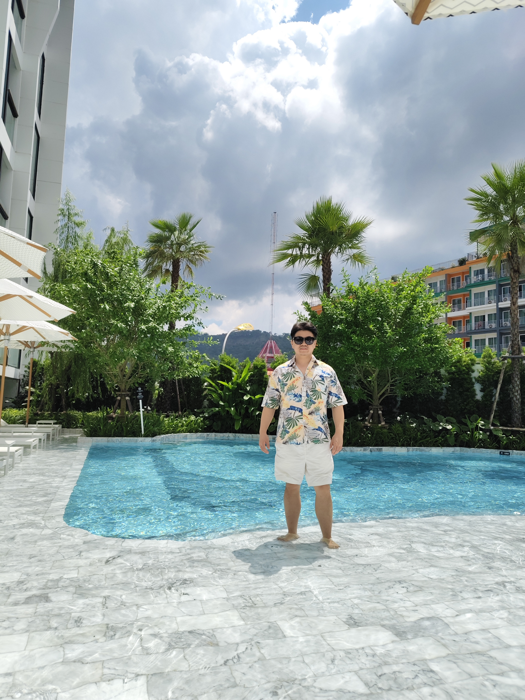

# About Me

Here is **Gao Wei** [(Victor, 高伟)](https://scholar.google.com/citations?user=VfovrnEAAAAJ&hl=en). 

I'm an Algorithm Engineer at ByteDance, specializing in Multimodal Large Language Models (MLLMs) and Diffusion Models. Prior to joining ByteDance, I held positions at ZEEKR and Alibaba (Amap), where I focused on perception algorithms within the mapping and navigation sector..

I am always open to academic discussions and potential collaborations. Please feel free to reach out to me at **vasgaowei@gmail.com**

---

## Research Interests

- Understanding: MLLM, Unified MLLM, MLLM-Embedding 
- Generation: Diffusion Model, Flow Matching, Regressive Model

---

## News and Updates

- **Aug 2021：** Discrepant multiple instance learning for weakly supervised object detection is accept by Pattern Recognition
- **July 2021：** TS-CAM: Token Semantic Coupled Attention Map for Weakly Supervised Object Localization is accept by ICCV 2021

 